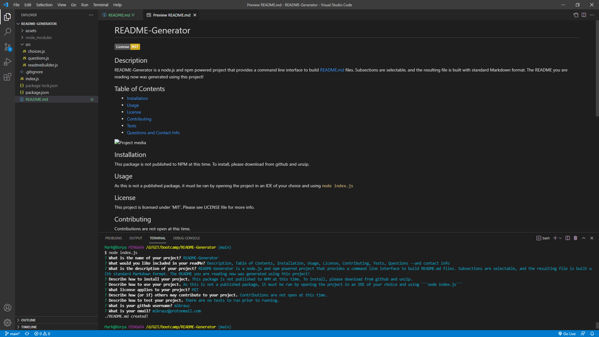

# README-Generator

[](https://opensource.org/licenses/MIT)

## Description
README-Generator is a node.js and npm powered project that provides a command line interface to build README.md files. Subsections are selectable, and the resulting file is built with standard Markdown format. The README you are reading now was generated using this project!

## Table of Contents
* [Installation](#installation)
* [Usage](#usage)
* [License](#license)
* [Contributing](#contributing)
* [Tests](#tests)
* [Questions and Contact Info](#questions-and-contact-info)



## Installation
This package is not published to NPM at this time. To install, please download from github and unzip.

## Usage
As this is not a published package, it must be ran by opening the project in an IDE of your choice and using ```node index.js```

## License
This project is licensed under 'MIT'. Please see LICENSE file for more info.

## Contributing
Contributions are not open at this time.

## Tests
There are no tests to run prior to running.

## Questions and Contact Info
* Github: https://github.com/mlkrauz
* Email: mlkrauz@protonmail.com